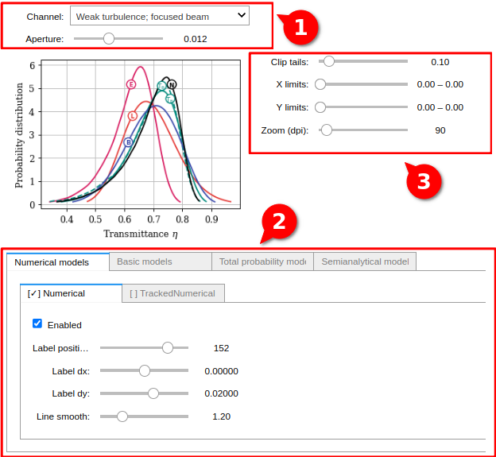

# Numerical simulations of atmospheric quantum channels: Supplementary materials

## Structure

- **01_interactive** - contains a Jupyter notebook for interactive study of the data (PDT- and KS-values) for different channels and aperture radii;
- **02_data_sample** - contains samples of the transmittance in the `.csv` format: several aperture radii for three channels (100 000 iterations);  
- **03_results** - contains the transformed data: PDT- and KS-values for all the numerical and analytical models;
- **04_src** - the source code of the project.

See below for details.


## Interactive Jupyter notebook

You can run the Jupyter notebook locally or use the ready-to-use online Google Colab notebook: https://colab.research.google.com/drive/1PINOk0FjQgH5rovDj6F6Q7gcL6m3-HE8 (Don't forget to run with `Runtime -> Run all`).

To run it locally, make sure you have [Python 3.8+](https://realpython.com/installing-python/#how-to-install-python-on-linux) installed.
Go to the `01_interactive` directory, create a [virtual environment](https://packaging.python.org/en/latest/tutorials/installing-packages/#creating-and-using-virtual-environments), [install the required packages](https://packaging.python.org/en/latest/tutorials/installing-packages/#use-pip-for-installing) from the `requirements.txt` file and start the jupyter-notebook server:
```
cd 01_interactive
python3 -m venv venv
source venv/bin/activate
python3 -m pip install -r requirements.txt
jupyter-notebook
```
Open the file `interactive.ipynb` in the opened Jupyter notebook file manager or using the link: http://localhost:8888/notebooks/interactive.ipynb.
Then run all the cells: `Kernel -> Restart & Run All`.

After that, you can interact with the user interface:


1. Change the channel (the parameters of the channels can be found in the paper) and the aperture radius.
2. Enable/disable the numerical and analytical models, adjust the line labels and smooth.
3. Change the figure parameters.


## Data sample
The transmittance data sample can be found in the files: `02_data_sample/{channel_name}/transmittance.csv`.

Available `channel_name` values:
- `weak_zap` -- Weak turbulence impact with wave-front radius $F_0=z_{ap}$.
- `weak_inf` -- Weak turbulence impact with wave-front radius $F_0=\infty$.
- `moderate_zap` -- Moderate turbulence impact with wave-front radius $F_0=z_{ap}$.
- `moderate_inf` -- Moderate turbulence impact with wave-front radius $F_0=\infty$.
- `strong_zap` -- Strong turbulence impact with wave-front radius $F_0=z_{ap}$.
- `strong_inf` -- Strong turbulence impact with wave-front radius $F_0=\infty$.

The `transmittance.csv` files are organised in such a way:
- The first row is the list of aperture radii.
- The next rows are samples of transmittances for each aperture radius.


## Results

The PDT functions can be found in the files `03_results/{channel_name}/{model_name}/{aperture_radius}.csv` files.

The Kolmogorov-Smirnov results can be found in the `03_results/{channel_name}/{model_name}/ks_values.csv` files.


## Source code

For details about the source code, please see the `04_src/README.md` file.
